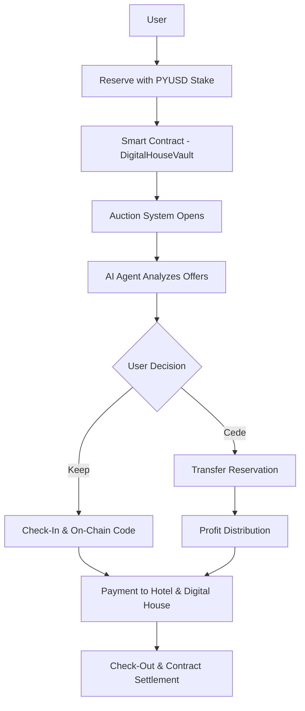

# 🏠 Digital House

### Decentralized Booking Platform with Auction System and AI Agents

**Eliminating billions in losses from last-minute cancellations through blockchain auctions and PYUSD**

[](https://ethglobal.com/events/ethonline2024)
[](https://opensource.org/licenses/MIT)
[](https://soliditylang.org/)
[](https://nextjs.org/)

---

## 🎯 The Problem

The booking industry (hotels, events, flights) loses **billions of dollars annually** due to last-minute cancellations:
- Hotels with empty rooms losing revenue
- Users losing their deposits
- No secondary market for transferring reservations
- Inefficient system for everyone involved

## 💡 Our Solution

Digital House creates a **decentralized booking ecosystem** where:
- ✅ Users stake PYUSD to secure reservations
- ✅ **Auction system** allows transferring reservations with value
- ✅ Smart contracts automate all logic transparently
- ✅ AI agents enhance user experience
- ✅ Access codes generated on-chain

---

## 🚀 Live Demo

- **App:** Coming soon
- **Smart Contracts:** [View on Sepolia Etherscan](https://sepolia.etherscan.io) *(Deploy in progress)*
- **Video Demo:** Coming soon *(5 min walkthrough)*

---

## 📋 Table of Contents

- [How It Works](#-how-it-works)
- [Key Features](#-key-features)
- [Payment Distribution](#-payment-distribution)
- [Technical Architecture](#-technical-architecture)
- [Smart Contracts](#-smart-contracts)
- [Getting Started](#-getting-started)
- [Project Structure](#-project-structure)
- [Team](#-team)
- [Roadmap](#-roadmap)

---

## 🔄 How It Works

### Complete User Flow



### Step-by-Step Example

```
┌─────────────────────────────────────────────────────────────┐
│                    DIGITAL HOUSE FLOW                        │
└─────────────────────────────────────────────────────────────┘

1️⃣ INITIAL RESERVATION (FREE → AUCTION)
   María wants to book apartment Oct 20-25
   ├─ Stakes: 1,000 PYUSD (floor price)
   ├─ Receives: 100% ownership shares in vault
   ├─ State changes: FREE → AUCTION
   └─ Booking ID (nonce): #1

2️⃣ AUCTION PERIOD (AUCTION state)
   Other users can place higher bids
   ├─ Juan offers: 1,200 PYUSD (+200 additional)
   ├─ Pedro offers: 1,500 PYUSD (+500 additional)
   └─ María has until 24h before check-in to decide

3️⃣ DECISION TIME (AUCTION state)
   
   Option A: Keep Reservation
   └─ María keeps booking, all bids refunded automatically
   
   Option B: Cede Reservation (Citizen Value Distribution)
   María accepts Pedro's offer (1,500 PYUSD)
   
   ⚡ CRITICAL: Distribution applies ONLY to ADDITIONAL value
   Additional Value = 1,500 - 1,000 = 500 PYUSD
   
   Distribution of 500 PYUSD additional:
   ├─ 50% (250 PYUSD) → Hotel (vault owner)
   ├─ 30% (150 PYUSD) → María (original booker)
   └─ 20% (100 PYUSD) → Digital House multisig
   
   María receives TOTAL:
   ├─ Original stake returned: 1,000 PYUSD
   ├─ Profit (30% of additional): 150 PYUSD
   └─ TOTAL: 1,150 PYUSD ✅ (15% ROI)
   
   Pedro becomes new reservation owner with 1,500 PYUSD stake

4️⃣ CHECK-IN (AUCTION → SETTLED)
   October 20 - Check-in day
   ├─ Pedro executes check-in transaction
   ├─ His 1,500 PYUSD stake is distributed:
   │   ├─ 95% (1,425 PYUSD) → Hotel owner
   │   └─ 5% (75 PYUSD) → Digital House
   ├─ Smart contract generates: 6-digit code "234567"
   ├─ QR code created for easy access
   └─ Code opens smart lock box with room key card

5️⃣ CHECK-OUT (SETTLED → FREE)
   October 25 - Check-out day
   ├─ Pedro completes check-out
   ├─ Contract finalizes and settles
   ├─ Vault returns to FREE state
   ├─ Booking ID increments: #2
   └─ Property ready for next reservation
```

---

## 💸 Payment Distribution

### Distribution System Explained

Digital House uses a **dual distribution model**:

#### 1️⃣ Normal Payment (on Floor Price / Stake)

When a guest checks in, **100% of their stake** is distributed:

| Recipient | Percentage | Example (1,000 PYUSD) |
|-----------|------------|----------------------|
| **Hotel Owner** (vault creator) | 95% | 950 PYUSD |
| **Digital House** (`0x854b...5822`) | 5% | 50 PYUSD |

**Use case:** Standard booking without auction activity.

---

#### 2️⃣ Citizen Value Distribution (on Additional Value ONLY)

When original booker cedes reservation to higher bidder, **ONLY the additional value** is distributed:

**Example:** 
- Original stake: 1,000 PYUSD
- Winning bid: 1,500 PYUSD
- **Additional value: 500 PYUSD** ← Only this is distributed

| Recipient | % | Amount (500 PYUSD) |
|-----------|---|-------------------|
| **Hotel Owner** | 50% | 250 PYUSD |
| **Original Booker** | 30% | 150 PYUSD |
| **Digital House** | 20% | 100 PYUSD |

**PLUS:** Original booker gets full stake back: **+1,000 PYUSD**

**Total Original Booker receives: 1,150 PYUSD** (150 PYUSD profit = 15% ROI)

---

### Complete Example with Numbers

```
Scenario: 5-night luxury apartment reservation

Initial Booking:
├─ Floor price: 1,000 PYUSD
├─ María stakes: 1,000 PYUSD
└─ Status: María has 100% ownership

Auction Activity:
├─ Juan bids: 1,200 PYUSD (rejected)
├─ Pedro bids: 1,500 PYUSD (accepted)
└─ Additional value: 500 PYUSD

Cession Distribution (500 PYUSD):
├─ Hotel receives: 250 PYUSD (50%)
├─ María receives: 150 PYUSD (30%)
├─ Digital House: 100 PYUSD (20%)
└─ María's stake returned: +1,000 PYUSD

Check-in Payment (1,500 PYUSD from Pedro):
├─ Hotel receives: 1,425 PYUSD (95%)
└─ Digital House: 75 PYUSD (5%)

FINAL TOTALS:
├─ Hotel earned: 250 + 1,425 = 1,675 PYUSD (67.5% extra via auction!)
├─ María earned: 150 PYUSD profit on 1,000 stake (15% ROI)
├─ Digital House: 100 + 75 = 175 PYUSD
└─ Pedro: Got the apartment he urgently needed
```

**Everyone wins! 🎉**

```
┌─────────────────────────────────────────────────────────────┐
│                    DIGITAL HOUSE FLOW                        │
└─────────────────────────────────────────────────────────────┘

1️⃣ INITIAL RESERVATION (FREE → AUCTION)
   User A wants to book apartment Oct 20-25
   ├─ Stakes: 1,000 PYUSD
   ├─ Receives: 100% ownership (shares in vault)
   ├─ State: AUCTION
   └─ Nonce: 1

2️⃣ AUCTION SYSTEM (AUCTION)
   Other users can offer more
   ├─ User B offers: 1,200 PYUSD
   ├─ User C offers: 1,500 PYUSD
   └─ User A has until 1 day before check-in to decide

3️⃣ DECISION (AUCTION)
   
   Option A: Keep Reservation
   └─ User A maintains booking, bids refunded
   
   Option B: Cede Reservation (Citizen Value)
   User A cedes to User C (1,500 PYUSD offer)
   
   ⚡ IMPORTANT: Distribution applies ONLY to additional value
   Additional Value = 1,500 - 1,000 = 500 PYUSD
   
   Distribution of 500 PYUSD:
   ├─ 50% (250 PYUSD) → Hotel (vault owner)
   ├─ 30% (150 PYUSD) → User A  
   └─ 20% (100 PYUSD) → Digital House
   
   User A receives:
   ├─ Original stake returned: 1,000 PYUSD
   ├─ Profit (30% of additional): 150 PYUSD
   └─ TOTAL: 1,150 PYUSD ✅
   
   User C now owns the reservation with 1,500 PYUSD stake

4️⃣ CHECK-IN (AUCTION → SETTLED)
   Day of check-in (Oct 20)
   ├─ User executes check-in
   ├─ PYUSD payment distributed:
   │   ├─ 95% → Real Estate/Hotel
   │   └─ 5% → Digital House
   ├─ Generates 6-digit code: "234567"
   └─ Code opens box with room access card

5️⃣ CHECK-OUT (SETTLED → FREE)
   Day of check-out (Oct 25)
   ├─ User executes check-out
   ├─ Contract settles
   ├─ Vault returns to FREE state
   └─ Nonce increments: 2
```

---

## ✨ Key Features

### 🔐 Blockchain-Powered Reservations
- Immutable reservations on Ethereum
- PYUSD stablecoin for payments
- Transparent smart contracts
- No intermediaries needed

### 💰 Auction System
- Secondary market for reservations
- Price discovery through competitive bidding
- Fair value distribution
- Win-win for all participants

### 🤖 AI Multi-Agent System
- Each vault has dedicated AI agent
- Real-time auction management
- Profit calculations and recommendations
- 24/7 user support

### 🎟️ On-Chain Access Codes
- 6-digit codes generated on-chain
- Unique per reservation
- QR code integration
- Smart lock compatible

### 💸 Fair Payment Distribution

See detailed breakdown in [Payment Distribution](#-payment-distribution) section above.

**Summary:**
- **Normal payment:** 95% Hotel, 5% Digital House
- **Citizen Value:** 50% Hotel, 30% User, 20% Digital House (on additional value only)
- **Digital House Multisig:** `0x854b298d922fDa553885EdeD14a84eb088355822`

---

## 🏗️ Technical Architecture

```
┌─────────────────────────────────────────────────────────────┐
│                    ARCHITECTURE LAYERS                       │
└─────────────────────────────────────────────────────────────┘

┌──────────────────────────────────────────────────────────────┐
│  FRONTEND LAYER (Next.js 14 + TypeScript)                   │
│  ┌────────────┐  ┌────────────┐  ┌────────────┐            │
│  │  Dashboard │  │  Auction   │  │  AI Chat   │            │
│  │  Component │  │  Panel     │  │  Interface │            │
│  └────────────┘  └────────────┘  └────────────┘            │
└──────────────────────────────────────────────────────────────┘
                           ↓
┌──────────────────────────────────────────────────────────────┐
│  WEB3 INTEGRATION LAYER                                      │
│  ┌─────────┐  ┌─────────┐  ┌──────────┐  ┌──────────┐      │
│  │ Privy   │  │  Viem   │  │  Wagmi   │  │  Ethers  │      │
│  │ (Auth)  │  │ (Chain) │  │  (Hooks) │  │  (Utils) │      │
│  └─────────┘  └─────────┘  └──────────┘  └──────────┘      │
└──────────────────────────────────────────────────────────────┘
                           ↓
┌──────────────────────────────────────────────────────────────┐
│  SMART CONTRACT LAYER (Solidity 0.8.20)                     │
│  ┌──────────────────────────────────────────────────────┐   │
│  │  DigitalHouseFactory.sol                             │   │
│  │  - createVault()                                     │   │
│  │  - getVaultInfo()                                    │   │
│  └──────────────────────────────────────────────────────┘   │
│                           ↓                                  │
│  ┌──────────────────────────────────────────────────────┐   │
│  │  DigitalHouseVault.sol (Multiple Instances)         │   │
│  │  - createReservation()                               │   │
│  │  - placeBid()                                        │   │
│  │  - cedeReservation()                                 │   │
│  │  - checkIn()                                         │   │
│  │  - checkOut()                                        │   │
│  └──────────────────────────────────────────────────────┘   │
└──────────────────────────────────────────────────────────────┘
                           ↓
┌──────────────────────────────────────────────────────────────┐
│  BLOCKCHAIN LAYER                                            │
│  ┌──────────────┐  ┌──────────────┐  ┌──────────────┐      │
│  │   Ethereum   │  │   Arbitrum   │  │     Base     │      │
│  │   Sepolia    │  │   Sepolia    │  │   Sepolia    │      │
│  └──────────────┘  └──────────────┘  └──────────────┘      │
└──────────────────────────────────────────────────────────────┘
                           ↓
┌──────────────────────────────────────────────────────────────┐
│  PAYMENT LAYER                                               │
│  ┌──────────────────────────────────────────────────────┐   │
│  │  PYUSD (PayPal USD Stablecoin)                       │   │
│  │  - Ethereum Sepolia: 0xCaC524...3bB9                 │   │
│  │  - Arbitrum Sepolia: 0x637A12...aB1B1                │   │
│  └──────────────────────────────────────────────────────┘   │
└──────────────────────────────────────────────────────────────┘
                           ↓
┌──────────────────────────────────────────────────────────────┐
│  AI LAYER (Optional - Can use Mock for MVP)                 │
│  ┌──────────────────────────────────────────────────────┐   │
│  │  ASI (Artificial Superintelligence Alliance)         │   │
│  │  - Auction analysis                                  │   │
│  │  - Profit calculations                               │   │
│  │  - User guidance                                     │   │
│  │  - Event notifications                               │   │
│  └──────────────────────────────────────────────────────┘   │
└──────────────────────────────────────────────────────────────┘
```

---

## 📜 Smart Contracts

### Contract States

```solidity
enum VaultState {
    FREE,      // Available for booking
    AUCTION,   // Has reservation, accepting bids
    SETTLED    // Check-in completed
}
```

### Main Contracts

#### 1. DigitalHouseFactory.sol
Factory pattern for creating multiple vault instances.

**Key Functions:**
- `createVault(vaultId, propertyDetails, basePrice)` - Create new property vault
- `getVaultAddress(vaultId)` - Get vault address by ID
- `getAllVaultIds()` - List all created vaults

#### 2. DigitalHouseVault.sol
Core contract managing reservations, auctions, and payments.

**Key Functions:**

**Reservation Management:**
- `createReservation(stakeAmount, checkInDate, checkOutDate)` - Create initial reservation
- `cancelReservation()` - Cancel and move to next bidder
- `getCurrentReservation()` - Get current reservation details

**Auction System:**
- `placeBid(bidAmount)` - Make an offer on existing reservation
- `withdrawBid(bidIndex)` - Withdraw your bid
- `cedeReservation(bidIndex)` - Original booker cedes to highest bidder
- `getAuctionBids()` - Get all active bids

**Check-in/Check-out:**
- `checkIn()` - Execute check-in and generate access code
- `checkOut()` - Complete stay and settle contract

**View Functions:**
- `getVaultInfo()` - Get vault state, price, and nonce
- `currentState()` - Get current vault state

### Deployed Contracts

#### Ethereum Sepolia
```
Factory: 0x... (Coming soon)
PYUSD:   0xCaC524BcA292aaade2DF8A05cC58F0a65B1B3bB9
```

#### Arbitrum Sepolia
```
Factory: 0x... (Coming soon)
PYUSD:   0x637A1259C6afd7E3AdF63993cA7E58BB438aB1B1
```

#### Base Sepolia
```
Factory: 0x... (Coming soon)
PYUSD:   TBD
```

---

## 🚀 Getting Started

### Prerequisites

- Node.js 18+ and npm/yarn
- Git
- MetaMask or compatible Web3 wallet
- PYUSD testnet tokens (we'll provide faucet)

### Installation

#### 1. Clone the Repository

```bash
git clone https://github.com/your-org/digital-house-ethonline.git
cd digital-house-ethonline
```

#### 2. Install Smart Contract Dependencies

```bash
cd contracts
npm install
```

Create `.env` file:
```env
PRIVATE_KEY=your_private_key_here
SEPOLIA_RPC_URL=https://sepolia.infura.io/v3/YOUR_KEY
ARBITRUM_SEPOLIA_RPC_URL=https://sepolia-rollup.arbitrum.io/rpc
ETHERSCAN_API_KEY=your_etherscan_key
ARBISCAN_API_KEY=your_arbiscan_key
```

#### 3. Deploy Contracts (Optional - Already Deployed)

```bash
# Compile contracts
npx hardhat compile

# Run tests
npx hardhat test

# Deploy to Sepolia
npx hardhat run scripts/deploy.ts --network sepolia

# Verify contracts
npx hardhat verify --network sepolia DEPLOYED_ADDRESS CONSTRUCTOR_ARGS
```

#### 4. Install Frontend Dependencies

```bash
cd ../frontend
npm install
```

Create `.env.local` file:
```env
NEXT_PUBLIC_PRIVY_APP_ID=your_privy_app_id
NEXT_PUBLIC_FACTORY_ADDRESS=0x...
NEXT_PUBLIC_PYUSD_SEPOLIA=0xCaC524BcA292aaade2DF8A05cC58F0a65B1B3bB9
NEXT_PUBLIC_PYUSD_ARBITRUM=0x637A1259C6afd7E3AdF63993cA7E58BB438aB1B1
```

#### 5. Run Development Server

```bash
npm run dev
```

Open [http://localhost:3000](http://localhost:3000)

---

## 📖 Usage Guide

### For Property Owners

1. **Connect Wallet**
   - Click "Connect Wallet" in header
   - Approve Privy authentication

2. **Create Vault**
   - Navigate to "Create Property"
   - Fill in property details
   - Set base price in PYUSD
   - Deploy vault

3. **Manage Bookings**
   - View incoming reservations
   - Monitor auction activity
   - Receive payments automatically

### For Guests/Users

#### Making a Reservation

1. **Browse Properties**
   - Explore available vaults
   - Check property details and pricing

2. **Create Reservation**
   - Select check-in/check-out dates
   - Approve PYUSD tokens
   - Stake PYUSD for reservation
   - Receive ownership shares

3. **Monitor Auction**
   - View incoming bids
   - AI agent shows profit calculations
   - Decide to keep or cede reservation

#### Bidding on Existing Reservations

1. **Find Active Reservation**
   - Browse vaults in AUCTION state
   - Check current stake amount

2. **Place Bid**
   - Enter bid amount (must be higher than current stake)
   - Approve PYUSD
   - Submit bid transaction

3. **Wait for Decision**
   - Original booker has until 1 day before check-in
   - If accepted, you become the new booker
   - If rejected, funds are automatically returned

#### Ceding Your Reservation

1. **Review Bids**
   - AI agent shows all active offers
   - See profit calculation for each bid

2. **Calculate Profit**
   ```
   Example:
   Your stake: 1,000 PYUSD
   Highest bid: 1,500 PYUSD
   Additional value: 500 PYUSD
   
   You receive:
   - 30% of 500 = 150 PYUSD (profit)
   - 1,000 PYUSD (stake returned)
   - Total: 1,150 PYUSD ✅
   ```

3. **Cede Reservation**
   - Select winning bid
   - Confirm distribution
   - Receive PYUSD automatically

#### Check-In

1. **Execute Check-In**
   - On check-in day, click "Check In"
   - Payment automatically distributed
   - Receive 6-digit access code

2. **Access Property**
   - Use code or scan QR
   - Open smart lock box
   - Get room access card

#### Check-Out

1. **Complete Stay**
   - On check-out day, click "Check Out"
   - Contract settles automatically
   - Vault becomes available again

---

## 🛠️ Technology Stack

### Smart Contracts
- **Solidity 0.8.20** - Smart contract language
- **Hardhat** - Development environment
- **OpenZeppelin** - Secure contract libraries
- **Ethers.js** - Ethereum library

### Frontend
- **Next.js 14** - React framework with App Router
- **TypeScript** - Type-safe JavaScript
- **Tailwind CSS** - Utility-first CSS framework
- **Privy** - Wallet authentication
- **Viem & Wagmi** - Web3 React hooks

### Blockchain
- **Ethereum Sepolia** - Primary testnet
- **Arbitrum Sepolia** - L2 scaling solution
- **Base Sepolia** - Coinbase L2 (optional)
- **PYUSD** - PayPal USD stablecoin

### AI/ML (Optional)
- **ASI (Fetch.ai)** - Multi-agent system
- **OpenAI GPT-3.5** - Fallback option
- **Mock Agents** - MVP without external AI

### Infrastructure
- **Vercel** - Frontend hosting
- **GitHub** - Version control
- **IPFS** - Decentralized storage (future)

---

## 👥 Team

### Core Team

**linktavo** - Product Manager & Fullstack Developer
- GitHub: [@linktavo](https://github.com/linktavo)
- Role: Product vision, frontend architecture, coordination

**wmb81321** - IT Product Manager
- GitHub: [@wmb81321](https://github.com/wmb81321)
- Role: QA, testing, documentation, video production

**Taniaagredo** - Fullstack Developer
- GitHub: [@Taniaagredo](https://github.com/Taniaagredo)
- Role: UI/UX implementation, design system, frontend polish

**DevJhonnTorres** - Fullstack Developer
- GitHub: [@DevJhonnTorres](https://github.com/DevJhonnTorres)
- Role: Core components, AI integration, auction system

**ICREE8** - Smart Contract Developer
- GitHub: [@ICREE8](https://github.com/ICREE8)
- Role: Solidity development, testing, deployment, security

### Contact

- **Email:** team@digitalhouse.io
- **Twitter:** [@DigitalHouseWeb3](https://twitter.com/...)
- **Discord:** [Join our community](https://discord.gg/...)

---

## 🗺️ Roadmap

### ✅ Phase 1: MVP (ETHOnline 2024)
- [x] Core smart contracts
- [x] Factory pattern for multiple vaults
- [x] Auction system with citizen value
- [x] Basic frontend with wallet integration
- [x] PYUSD payment integration
- [x] Access code generation
- [ ] AI agent integration (in progress)
- [ ] Deploy to testnet
- [ ] Demo video and documentation

### 🔄 Phase 2: Beta Launch (Q4 2024)
- [ ] Mainnet deployment
- [ ] 5-10 real properties onboarded
- [ ] Mobile-responsive design
- [ ] Advanced AI features
- [ ] Multi-chain support (Polygon, Optimism)
- [ ] Insurance integration

### 🚀 Phase 3: Scale (Q1-Q2 2025)
- [ ] 100+ properties across 10 cities
- [ ] Mobile app (iOS/Android)
- [ ] Reputation system with NFTs
- [ ] Dynamic pricing with ML
- [ ] Partnership with hotel chains
- [ ] DAO governance ($HOUSE token)

### 🌟 Phase 4: Expansion (Q3-Q4 2025)
- [ ] International expansion
- [ ] Events and flights integration
- [ ] Multi-property packages
- [ ] B2B API for travel platforms
- [ ] Loyalty rewards program
- [ ] Carbon offset integration

---

## 📊 Market Opportunity

### Industry Problem

- **$100B+** lost annually in cancellations (hotels alone)
- **40%** of hotel bookings are modified or cancelled
- **$50-150** average cancellation fee per booking
- **No secondary market** for transferring reservations

### Our Solution Impact

- **100%** uptime for properties (always paid)
- **+30%** extra revenue through auctions
- **Win-win** for all participants
- **Transparent** blockchain-based system

### Target Market

- **Primary:** Vacation rentals, boutique hotels, event venues
- **Secondary:** Flights, concert tickets, restaurant reservations
- **Future:** Any bookable resource with high cancellation rates

---

## 🔒 Security

### Smart Contract Security

- ✅ ReentrancyGuard on all critical functions
- ✅ Access control with Ownable pattern
- ✅ Input validation and require statements
- ✅ No direct ETH handling (PYUSD only)
- ✅ Pausable for emergencies
- ⏳ External audit pending (OpenZeppelin/ConsenSys)

### Frontend Security

- ✅ Environment variables properly managed
- ✅ Input sanitization
- ✅ XSS protection
- ✅ CSRF tokens
- ✅ Secure WebSocket connections

### Best Practices

- Regular security audits
- Bug bounty program (coming soon)
- Transparent code (open source)
- Multi-sig for admin functions
- Time-locks for critical changes

---

## 📄 License

This project is licensed under the MIT License - see the [LICENSE](LICENSE) file for details.

---

## 🙏 Acknowledgments

- **ETHGlobal** - For organizing ETHOnline 2024
- **PayPal/PYUSD** - For stablecoin integration
- **Privy** - For seamless wallet authentication
- **OpenZeppelin** - For secure smart contract libraries
- **Fetch.ai** - For AI agent technology
- **Community** - For feedback and support

---

## 📚 Additional Resources

### Documentation
- [Technical Documentation](./docs/TECHNICAL.md)
- [Smart Contract API](./docs/CONTRACTS.md)
- [Deployment Guide](./docs/DEPLOYMENT.md)
- [User Guide](./docs/USER_GUIDE.md)

### Links
- [Demo Video](https://youtube.com/...) - 5 minute walkthrough
- [Pitch Deck](https://...) - Investor presentation
- [Figma Design](https://figma.com/...) - UI/UX mockups
- [Block Explorer](https://sepolia.etherscan.io/address/0x...) - Verified contracts

### Community
- [Discord](https://discord.gg/...) - Join our community
- [Twitter](https://twitter.com/...) - Follow for updates
- [Blog](https://medium.com/@digitalhouse) - Technical articles

---

## 🎉 Built for ETHOnline 2024

**Digital House** - Revolutionizing bookings with blockchain, one reservation at a time.

[🚀 Try Demo](https://digitalhouse.vercel.app) | [📺 Watch Video](https://youtube.com/...) | [💬 Join Discord](https://discord.gg/...)

---

Made with ❤️ by the Digital House Team